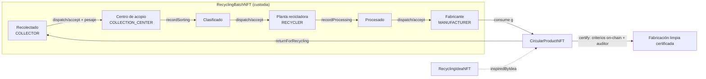

# ToKlean – Smart contracts de impacto ambiental

Suite de NFTs para **verificar y trazar acciones de limpieza y mejora ambiental** en Polygon (EVM, Solidity 0.8.28, OpenZeppelin 5.4, Foundry).

| Contrato | Símbolo | Qué representa | Transferible |
| --- | --- | --- | --- |
| `TreeNFT` | TKTREE | Árbol plantado + historial de crecimiento (altura, salud, CO2 estimado) | Sí (apadrinamiento); el plantador queda fijo |
| `RecyclingIdeaNFT` | TKIDEA | Idea de reciclaje: prueba de autoría, respaldos, curaduría e implementaciones | Sí, con regalías ERC‑2981 (5 %) al autor |
| `RecyclingBatchNFT` | TKBATCH | Pasaporte de un lote de material: cadena de custodia y pesajes | Sólo por handshake de custodia |
| `CircularProductNFT` | TKPROD | Pasaporte digital de producto hecho con material reciclado + datos de fabricación limpia | Sí (sigue al producto físico) |
| `CleanupActionNFT` | TKCLEAN | Insignia por participar en una jornada de limpieza verificada | No (soulbound, ERC‑5192) |

Todos heredan de `ImpactNFTBase`: `AccessControl`, pausa de emergencia, metadata 100 % on‑chain (JSON base64, entradas de usuario escapadas) y evidencias como `hash + URI` (IPFS/Arweave).

## Flujo circular



### Garantías que imponen los contratos

- **Separación de funciones**: nadie verifica su propio árbol, idea, campaña o producto (`SelfVerification`).
- **Balance de masa**: cada pesaje ≤ pesaje anterior (+2 % de tolerancia de báscula sólo en cambios de custodia); clasificación y procesamiento sólo pueden bajar el peso.
- **Sin doble gasto de material**: el producto descuenta gramos del lote on‑chain; un lote agotado pasa a `Consumed`.
- **Custodia real**: el NFT del lote lo tiene siempre el custodio físico; `transferFrom` está bloqueado.
- **RAEE y baterías** (Ley REP 20.920): sólo cuentas con `HAZARDOUS_HANDLER_ROLE` (gestor con autorización sanitaria, D.S. 148/2003) pueden recibirlos antes de procesarse.
- **Crédito al recolector** con el peso medido por el centro de acopio, no con el autodeclarado.
- **Fabricación limpia** = criterios on‑chain (`minRecycledContentBps`, `minRenewableEnergyBps`, `maxCo2eGramsPerKg`) **y** firma de un auditor; revocable.
- **Limpiezas**: Merkle root publicado por un verificador ≠ organizador; la suma reclamada nunca supera lo pesado; cualquiera puede pagar el gas del reclamo (relayer) pero el NFT va al participante.

## Roles

| Rol | Contratos | Quién debería tenerlo |
| --- | --- | --- |
| `DEFAULT_ADMIN_ROLE`, `PAUSER_ROLE` | todos | Safe multisig / Timelock de gobernanza |
| `VERIFIER_ROLE` | todos | ONGs, municipios, certificadoras, auditores |
| `COLLECTOR_ROLE` | Batch | Recicladores de base / recolectores registrados |
| `COLLECTION_CENTER_ROLE` | Batch | Centros de acopio / puntos limpios |
| `HAZARDOUS_HANDLER_ROLE` | Batch | Gestores autorizados de residuos peligrosos |
| `RECYCLER_ROLE` | Batch | Plantas de valorización |
| `MANUFACTURER_ROLE` | Batch, Product | Fabricantes |
| `CONSUMER_ROLE` | Batch | Sólo el contrato `CircularProductNFT` |
| `ORGANIZER_ROLE` | Cleanup | Organizadores de jornadas |

## Desarrollo

```sh
git submodule update --init --recursive
forge build --sizes
forge test -vvv
forge fmt --check
```

## Pruebas en testnet (Ethereum Sepolia, chainId 11155111)

Alternativa a Amoy cuando los faucets de Polygon exigen actividad en mainnet: los faucets de Sepolia
(p.ej. [PoW faucet](https://sepolia-faucet.pk910.de/)) no piden saldo previo.

```bash
cp .env.example .env   # PRIVATE_KEY, SEPOLIA_RPC_URL, TESTERS
make deploy-sepolia    # escribe deployments/11155111.json
make setup-sepolia
```

Luego copia `deployments/11155111.json` a `toklean-front/src/config/deployments/` y usa `VITE_PUBLIC_CHAIN_ID=11155111`.

## Pruebas en testnet (Polygon Amoy, chainId 80002)

1. **Fondos**: el despliegue completo consume ~17,2 M gas (≈0,5 POL a 30 gwei) y `SetupTestnet` ~1,2 M gas.
   Junta ~0,7 POL de prueba con varios faucets:
   [Alchemy](https://www.alchemy.com/faucets/polygon-amoy) (0,1/día),
   [QuickNode](https://faucet.quicknode.com/polygon/amoy),
   [Chainlink](https://faucets.chain.link/polygon-amoy),
   [GetBlock](https://getblock.io/faucet/matic-amoy/),
   [ETHGlobal](https://ethglobal.com/faucet/polygon-amoy-80002).
   Algunos exigen saldo/actividad mínima en Ethereum mainnet con la wallet que reclama; puedes reclamar con
   tu wallet personal y transferir a la de despliegue.
2. **Desplegar** (sin `ADMIN_ADDRESS`, el deployer queda como admin para asignar roles de prueba):
   ```sh
   cp .env.example .env   # PRIVATE_KEY, AMOY_RPC_URL, TESTERS
   make balance           # confirma POL
   make deploy-amoy       # escribe deployments/80002.json
   make setup-amoy        # da todos los roles a TESTERS (usa ≥2 wallets: nadie se auto-verifica)
   make abis              # regenera ABIs en ../toklean-front/src/abi/impact
   cp deployments/80002.json ../toklean-front/src/config/deployments/
   ```
3. **Sin faucet**: `make anvil` + `make deploy-local` levanta todo en un nodo local con cuentas con fondos.

## Despliegue

```sh
cp .env.example .env   # completar PRIVATE_KEY, ADMIN_ADDRESS, RPCs, POLYGONSCAN_API_KEY
source .env
forge script script/Deploy.s.sol --rpc-url amoy --broadcast --verify      # testnet
forge script script/Deploy.s.sol --rpc-url polygon --broadcast --verify   # mainnet
```

El script cablea `CONSUMER_ROLE`, transfiere admin/pauser a `ADMIN_ADDRESS` y el deployer renuncia a sus roles.

## Merkle tree de una jornada (off‑chain)

```js
import { StandardMerkleTree } from "@openzeppelin/merkle-tree";
const tree = StandardMerkleTree.of(
  [[participant, campaignId, grams], /* ... */],
  ["address", "uint256", "uint96"],
);
// finalizeCampaign(campaignId, tree.root, totalGrams, evidenceHash, evidenceURI)
// claim(participant, campaignId, grams, tree.getProof(i))
```

## Pendiente / siguientes pasos

- Auditoría externa antes de mainnet.
- Recompensas en `RecToken`/`TokleanToken` a partir de los eventos (contrato `RewardsDistributor` separado).
- Split/merge de lotes y oráculos de básculas IoT firmadas.
- Integración en `toklean-front` (ABIs en `out/`; migrar de Mumbai 80001, ya deprecada, a Amoy 80002).
